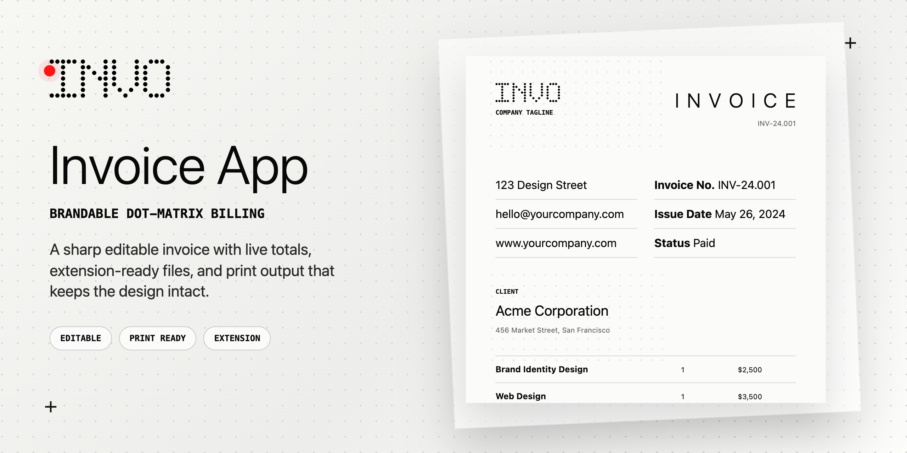

<p align="center">
  
</p>

# Dot Matrix Invoice App

Editable invoice page with a brandable studio layout, live totals, extension files, and print output that keeps the design intact.

## Highlights

- Edit invoice, studio, client, payment, notes, and line item text in place.
- Use a text brand, uploaded logo, editable tagline, and multiple company-name fonts.
- Switch between common currencies and GST/VAT presets, including Indian GST.
- Generate an invoice number from the toolbar.
- Fill the invoice from a pasted client/project brief.
- Add or remove line items.
- Update status and tax rate from the toolbar.
- Save changes in local browser storage.
- Print a one-page A4 invoice with the desktop layout preserved.
- Load as a simple browser page or as a Chrome extension from `dist/`.

## Preview

The interface is built around the invoice itself. The toolbar stays small, the document keeps a print-ready paper layout, and mobile screens get a compact line-item view.

## Run Locally

```bash
npm install
npm start
```

Then open `http://127.0.0.1:4173`.

You can also open `index.html` directly in a browser.

## Build Extension Files

Root source files are the editable source. Chrome extension files are copied into `dist/`.

```bash
npm run build:ext
```

To test as an extension, load the `dist/` folder as an unpacked extension in Chrome or Brave.

## Project Files

- `index.html`: app shell and toolbar
- `src/main.js`: invoice state, editing, totals, print flow
- `src/styles.css`: screen, mobile, and print styles
- `manifest.json`: extension manifest
- `scripts/build-ext.mjs`: copies root source into `dist/`
- `scripts/create-cover.mjs`: creates the GitHub cover image
- `assets/github-cover.png`: repository cover image
